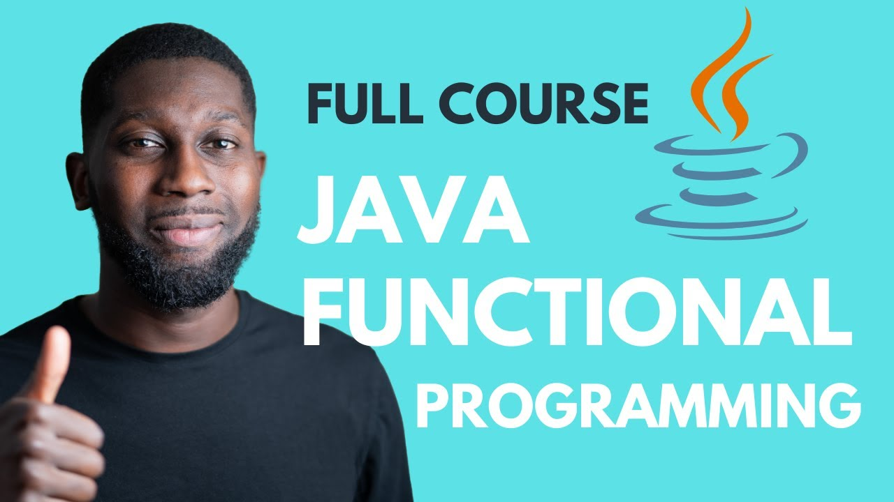
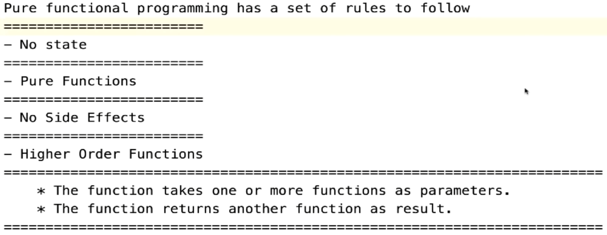

# Java Functional Programming
(https://www.classcentral.com/course/youtube-java-functional-programming-full-course-92917/classroom)

### Themes — Files
* Imperative Approach — imperative/Main.java
* Declarative Approach — imperative/Main.java
* Java Util Function Package — imperative/Main.java
* Function — functionalinterface/_Function.java
* BiFunction — functionalinterface/_Function.java
* Consumer — functionalinterface/_Consumer.java
* BiConsumer — functionalinterface/_Consumer.java
* Predicate — functionalinterface/_Predicate.java
* Supplier — functionalinterface/_Supplier.java
* Intro to Java Streams — functionalinterface/streams/_Stream.java
* More on Java Streams — functionalinterface/streams/_Stream.java
* Java Optionals — optionals/Main.java
* Combinator Pattern — combinatorpattern/Main.java 
  combinatorpattern/Customer.java, 
  combinatorpattern/CustomerValidatorService.java
* Implementing Combinator Pattern — combinatorpattern/CustomerRegistrationValidator.java
* Callbacks Like Javascript — finalsection/callbacks.java
* Lambdas — finalsection/Lambdas.java
* Properties of Functional Programming 
  

